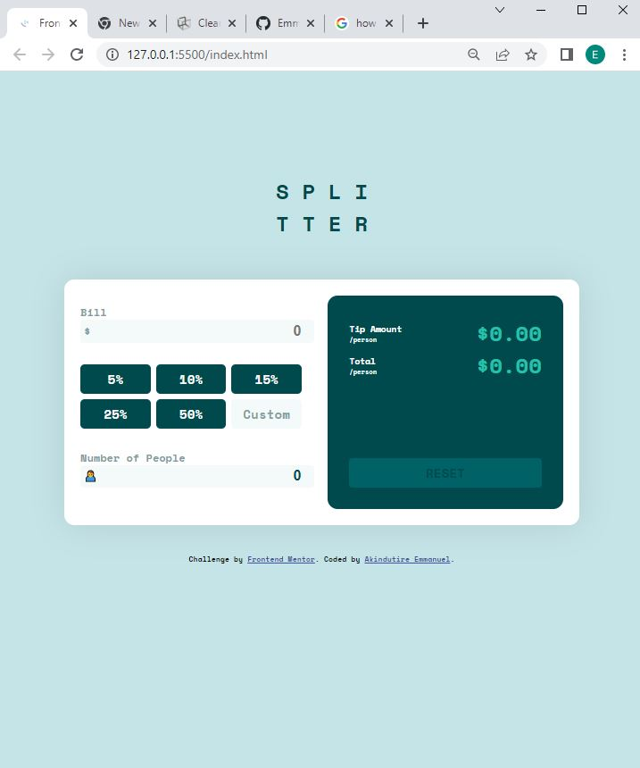

# Frontend Mentor - Tip calculator app

## Welcome! 👋

Thanks for checking out this front-end coding challenge.

[Frontend Mentor](https://www.frontendmentor.io) challenges help you improve your coding skills by building realistic projects.

### Built with

- Semantic HTML5 markup
- CSS custom properties
- Flexbox
- CSS pseudo elements
- Javascript

## The challenge

The challenge is to build out this tip calculator app and get it looking as close to the design as possible.

You can use any tools you like to help you complete the challenge. So if you've got something you'd like to practice, feel free to give it a go.

I was able to:
- I was able to style the tip calculator
- View the optimal layout for the app depending on their device's screen size
- See hover states for all interactive elements on the page
- Calculate the correct tip and total cost of the bill per person
- Use the reset button to clear all the value and input

## Building your project

I was mentored by my Instructor(Adegoke Temitope @FUTURE ACADEMY AFRICA) during the beginning of this project. I had to complete it on my own. It was my first project. And i was glad i gave it a go

## Deploying your project

- [GitHub Pages](https://emmakin.github.io/2nd-/)

### Useful resources
Stack overflow and W3schools were very helpful. There was also this particular website resource that was helpful(https://bobbyhadz.com/blog/javascript-clear-input-field-after-submit). There were other resources too which i didn't keep record of; am very sorry for this. Please forgive your boy.

### Continued development
I would love to complete this project in some areas, where i had issue in;[displaying the error message(can't be zero) and red outline(on the input borderline) using conditions.

I also hope to re-create this project using react js which am currently learning.

I plan on doing a project that involves searching for a variable in a list or sort off.

## Author

- Website - [Akindutire Emmanuel ](https://www.your-site.com)
- Frontend Mentor - [@yourusername](https://www.frontendmentor.io/profile/yourusername)
- Twitter - [@adewalemmakin](https://www.twitter.com/yourusername)

## Acknowledgments

I appreciate God for the grace. Special thanks to my mentor Adegoke Temitop and to Frontend Mentor.

**Have fun reading!** 🚀
